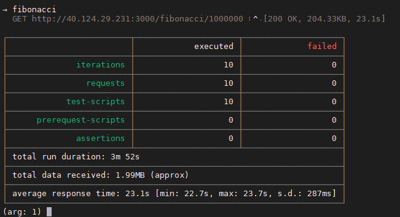
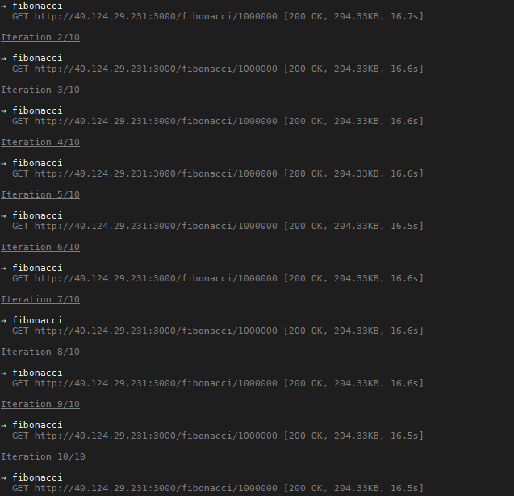
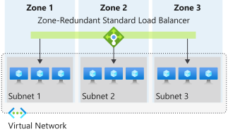

### Escuela Colombiana de Ingeniería
### Arquitecturas de Software - ARSW

## Escalamiento en Azure con Maquinas Virtuales, Sacale Sets y Service Plans

### Dependencias
* Cree una cuenta gratuita dentro de Azure. Para hacerlo puede guiarse de esta [documentación](https://azure.microsoft.com/en-us/free/search/?&ef_id=Cj0KCQiA2ITuBRDkARIsAMK9Q7MuvuTqIfK15LWfaM7bLL_QsBbC5XhJJezUbcfx-qAnfPjH568chTMaAkAsEALw_wcB:G:s&OCID=AID2000068_SEM_alOkB9ZE&MarinID=alOkB9ZE_368060503322_%2Bazure_b_c__79187603991_kwd-23159435208&lnkd=Google_Azure_Brand&dclid=CjgKEAiA2ITuBRDchty8lqPlzS4SJAC3x4k1mAxU7XNhWdOSESfffUnMNjLWcAIuikQnj3C4U8xRG_D_BwE). Al hacerlo usted contará con $200 USD para gastar durante 1 mes.

### Parte 0 - Entendiendo el escenario de calidad

Adjunto a este laboratorio usted podrá encontrar una aplicación totalmente desarrollada que tiene como objetivo calcular el enésimo valor de la secuencia de Fibonnaci.

**Escalabilidad**
Cuando un conjunto de usuarios consulta un enésimo número (superior a 1000000) de la secuencia de Fibonacci de forma concurrente y el sistema se encuentra bajo condiciones normales de operación, todas las peticiones deben ser respondidas y el consumo de CPU del sistema no puede superar el 70%.

### Parte 1 - Escalabilidad vertical

1. Diríjase a el [Portal de Azure](https://portal.azure.com/) y a continuación cree una maquina virtual con las características básicas descritas en la imágen 1 y que corresponden a las siguientes:
    * Resource Group = SCALABILITY_LAB
    * Virtual machine name = VERTICAL-SCALABILITY
    * Image = Ubuntu Server 
    * Size = Standard B1ls
    * Username = scalability_lab
    * SSH publi key = Su llave ssh publica


2. Para conectarse a la VM use el siguiente comando, donde las `x` las debe remplazar por la IP de su propia VM.

    `ssh scalability_lab@xxx.xxx.xxx.xxx`

3. Instale node, para ello siga la sección *Installing Node.js and npm using NVM* que encontrará en este [enlace](https://linuxize.com/post/how-to-install-node-js-on-ubuntu-18.04/).
4. Para instalar la aplicación adjunta al Laboratorio, suba la carpeta `FibonacciApp` a un repositorio al cual tenga acceso y ejecute estos comandos dentro de la VM:

    `git clone <your_repo>`

    `cd <your_repo>/FibonacciApp`

    `npm install`

5. Para ejecutar la aplicación puede usar el comando `npm FibinacciApp.js`, sin embargo una vez pierda la conexión ssh la aplicación dejará de funcionar. Para evitar ese compartamiento usaremos *forever*. Ejecute los siguientes comando dentro de la VM.

    `npm install forever -g`

    `forever start FibinacciApp.js`

6. Antes de verificar si el endpoint funciona, en Azure vaya a la sección de *Networking* y cree una *Inbound port rule* tal como se muestra en la imágen. Para verificar que la aplicación funciona, use un browser y user el endpoint `http://xxx.xxx.xxx.xxx:3000/fibonacci/6`. La respuesta debe ser `The answer is 8`.


7. La función que calcula en enésimo número de la secuencia de Fibonacci está muy mal construido y consume bastante CPU para obtener la respuesta. Usando la consola del Browser documente los tiempos de respuesta para dicho endpoint usando los siguintes valores:
    * 1000000
    * 1010000
    * 1020000
    * 1030000
    * 1040000
    * 1050000
    * 1060000
    * 1070000
    * 1080000
    * 1090000    

8. Dírijase ahora a Azure y verifique el consumo de CPU para la VM. (Los resultados pueden tardar 5 minutos en aparecer).


9. Ahora usaremos Postman para simular una carga concurrente a nuestro sistema. Siga estos pasos.
    * Instale newman con el comando `npm install newman -g`. Para conocer más de Newman consulte el siguiente [enlace](https://learning.getpostman.com/docs/postman/collection-runs/command-line-integration-with-newman/).
    * Diríjase hasta la ruta `FibonacciApp/postman` en una maquina diferente a la VM.
    * Para el archivo `[ARSW_LOAD-BALANCING_AZURE].postman_environment.json` cambie el valor del parámetro `VM1` para que coincida con la IP de su VM.
    * Ejecute el siguiente comando.

    ```
    newman run ARSW_LOAD-BALANCING_AZURE.postman_collection.json -e [ARSW_LOAD-BALANCING_AZURE].postman_environment.json -n 10 &
    newman run ARSW_LOAD-BALANCING_AZURE.postman_collection.json -e [ARSW_LOAD-BALANCING_AZURE].postman_environment.json -n 10
    ```

10. La cantidad de CPU consumida es bastante grande y un conjunto considerable de peticiones concurrentes pueden hacer fallar nuestro servicio. Para solucionarlo usaremos una estrategia de Escalamiento Vertical. En Azure diríjase a la sección *size* y a continuación seleccione el tamaño `B2ms`.


11. Una vez el cambio se vea reflejado, repita el paso 7, 8 y 9.
12. Evalue el escenario de calidad asociado al requerimiento no funcional de escalabilidad y concluya si usando este modelo de escalabilidad logramos cumplirlo.
13. Vuelva a dejar la VM en el tamaño inicial para evitar cobros adicionales.

**Preguntas**

1. ¿Cuántos y cuáles recursos crea Azure junto con la VM?
> Se crean 5 elementos sin contar la maquina virtual.
> - **Red**
> - **Ip Publica**
> - **Security Group**
> - **Interface de Red**
> - **Disco**
2. ¿Brevemente describa para qué sirve cada recurso?
> - **Red:** La Vnet a la que la ip privada hará parte.
> - **Ip Publica:** La ip publica con la que vamos a poder acceder a la VM
> - **Security Group:** Controlar el trafico de la red y los recursos que pertenecen al mismo grupo de seguridad
> - **Interface de Red:** Permite que la VM tenga conexion a internet y conexion a recursos locales.
> - **Disco:** La capacidad de la VM

3. ¿Al cerrar la conexión ssh con la VM, por qué se cae la aplicación que ejecutamos con el comando `npm FibonacciApp.js`? ¿Por qué debemos crear un *Inbound port rule* antes de acceder al servicio?

> Porque estamos corriendo la aplicación en la maquina virtual y para poder hacer peticiones a la aplicación desde el navegador debemos tener en cuenta dos puntos importantes:
> - Debe estar corriendo la aplicacion
> - La maquina virtual debe permitir el trafico por el puerto que deseemos y por eso se debe crear una regla de entrada para poder permitir este trafico.

4. Adjunte tabla de tiempos e interprete por qué la función tarda tando tiempo.

> 

> Porque los recursos de la maquina virtual son muy limitados y es una aplicacion que consume muchos recursos.

5. Adjunte imágen del consumo de CPU de la VM e interprete por qué la función consume esa cantidad de CPU.

> 

Fibonacci es una aplicación recursiva y necesita bastante CPU para poder realizar tantos calculos.

6. Adjunte la imagen del resumen de la ejecución de Postman. Interprete:

> 

    * Tiempos de ejecución de cada petición.

> 
    
    * Si hubo fallos documentelos y explique.

7. ¿Cuál es la diferencia entre los tamaños `B2ms` y `B1ls` (no solo busque especificaciones de infraestructura)?

> Apesar que la capacidad de la maquina aumenta logicamente aunmenta el costo de la maquina virtual ya que el desempeño de la maquina virtual será mucho mas eficiente.

8. ¿Aumentar el tamaño de la VM es una buena solución en este escenario?, ¿Qué pasa con la FibonacciApp cuando cambiamos el tamaño de la VM?

> En este escenario mejoró el desempeño reduciendo los tiempos de ejecución pero no se logró ver un cambio significativo en el desempeño a nivel de CPU

9. ¿Qué pasa con la infraestructura cuando cambia el tamaño de la VM? ¿Qué efectos negativos implica?

> Como el tamaño de la maquina se cambio con ello se modifican otros recursos que hacen parte de la maquina como el Disco y esto puede ocasionar que lo que estemos haciendo en la VM este inhabilitado mientras los cambios se realizan de forma

10. ¿Hubo mejora en el consumo de CPU o en los tiempos de respuesta? Si/No ¿Por qué?

> Si hubo mejora tanto en los tiempos de respuesta como en el uso de la CPU aunque en este ultimo no se notaron cambios realmente representativos.

11. Aumente la cantidad de ejecuciones paralelas del comando de postman a `4`. ¿El comportamiento del sistema es porcentualmente mejor?

> En esta ocasion los resultados arrojados fueron exactamente los mismos.

### Parte 2 - Escalabilidad horizontal

#### Crear el Balanceador de Carga

Antes de continuar puede eliminar el grupo de recursos anterior para evitar gastos adicionales y realizar la actividad en un grupo de recursos totalmente limpio.

1. El Balanceador de Carga es un recurso fundamental para habilitar la escalabilidad horizontal de nuestro sistema, por eso en este paso cree un balanceador de carga dentro de Azure tal cual como se muestra en la imágen adjunta.


2. A continuación cree un *Backend Pool*, guiese con la siguiente imágen.


3. A continuación cree un *Health Probe*, guiese con la siguiente imágen.


4. A continuación cree un *Load Balancing Rule*, guiese con la siguiente imágen.


5. Cree una *Virtual Network* dentro del grupo de recursos, guiese con la siguiente imágen.


#### Crear las maquinas virtuales (Nodos)

Ahora vamos a crear 3 VMs (VM1, VM2 y VM3) con direcciones IP públicas standar en 3 diferentes zonas de disponibilidad. Después las agregaremos al balanceador de carga.

1. En la configuración básica de la VM guíese por la siguiente imágen. Es importante que se fije en la "Avaiability Zone", donde la VM1 será 1, la VM2 será 2 y la VM3 será 3.


2. En la configuración de networking, verifique que se ha seleccionado la *Virtual Network*  y la *Subnet* creadas anteriormente. Adicionalmente asigne una IP pública y no olvide habilitar la redundancia de zona.


3. Para el Network Security Group seleccione "avanzado" y realice la siguiente configuración. No olvide crear un *Inbound Rule*, en el cual habilite el tráfico por el puerto 3000. Cuando cree la VM2 y la VM3, no necesita volver a crear el *Network Security Group*, sino que puede seleccionar el anteriormente creado.


4. Ahora asignaremos esta VM a nuestro balanceador de carga, para ello siga la configuración de la siguiente imágen.


5. Finalmente debemos instalar la aplicación de Fibonacci en la VM. para ello puede ejecutar el conjunto de los siguientes comandos, cambiando el nombre de la VM por el correcto

```
git clone https://github.com/daprieto1/ARSW_LOAD-BALANCING_AZURE.git

curl -o- https://raw.githubusercontent.com/creationix/nvm/v0.34.0/install.sh | bash
source /home/vm1/.bashrc
nvm install node

cd ARSW_LOAD-BALANCING_AZURE/FibonacciApp
npm install

npm install forever -g
forever start FibonacciApp.js
```

Realice este proceso para las 3 VMs, por ahora lo haremos a mano una por una, sin embargo es importante que usted sepa que existen herramientas para aumatizar este proceso, entre ellas encontramos Azure Resource Manager, OsDisk Images, Terraform con Vagrant y Paker, Puppet, Ansible entre otras.

#### Probar el resultado final de nuestra infraestructura

1. Porsupuesto el endpoint de acceso a nuestro sistema será la IP pública del balanceador de carga, primero verifiquemos que los servicios básicos están funcionando, consuma los siguientes recursos:

```
http://52.155.223.248/
http://52.155.223.248/fibonacci/1
```

2. Realice las pruebas de carga con `newman` que se realizaron en la parte 1 y haga un informe comparativo donde contraste: tiempos de respuesta, cantidad de peticiones respondidas con éxito, costos de las 2 infraestrucruras, es decir, la que desarrollamos con balanceo de carga horizontal y la que se hizo con una maquina virtual escalada.

3. Agregue una 4 maquina virtual y realice las pruebas de newman, pero esta vez no lance 2 peticiones en paralelo, sino que incrementelo a 4. Haga un informe donde presente el comportamiento de la CPU de las 4 VM y explique porque la tasa de éxito de las peticiones aumento con este estilo de escalabilidad.

```
newman run ARSW_LOAD-BALANCING_AZURE.postman_collection.json -e [ARSW_LOAD-BALANCING_AZURE].postman_environment.json -n 10 &
newman run ARSW_LOAD-BALANCING_AZURE.postman_collection.json -e [ARSW_LOAD-BALANCING_AZURE].postman_environment.json -n 10 &
newman run ARSW_LOAD-BALANCING_AZURE.postman_collection.json -e [ARSW_LOAD-BALANCING_AZURE].postman_environment.json -n 10 &
newman run ARSW_LOAD-BALANCING_AZURE.postman_collection.json -e [ARSW_LOAD-BALANCING_AZURE].postman_environment.json -n 10
```

**Preguntas**

* ¿Cuáles son los tipos de balanceadores de carga en Azure y en qué se diferencian?, ¿Qué es SKU, qué tipos hay y en qué se diferencian?, ¿Por qué el balanceador de carga necesita una IP pública?
> En Azure existen dos tipos de balanceadores de carga:
>1. **El balanceador de carga público** asigna la IP pública y el puerto del tráfico entrante a la IP privada y el puerto de la VM. El equilibrador de carga asigna el tráfico al revés para el tráfico de respuesta de la máquina virtual. Puede distribuir tipos específicos de tráfico en varias máquinas virtuales o servicios aplicando reglas de equilibrio de carga.
>2. El **balanceador de carga interno** distribuye el tráfico a los recursos que se encuentran dentro de una red virtual. Azure restringe el acceso a las direcciones IP frontend de una red virtual con equilibrio de carga. Las direcciones IP de front-end y las redes virtuales nunca se exponen directamente a un punto final de Internet. Las aplicaciones de línea de negocio internas se ejecutan en Azure y se accede a ellas desde Azure o desde recursos locales.

> Un SKU es un conjunto de números y letras, empleado para identificar, localizar y hacer seguimiento interno de un producto en una empresa o tienda.

>Load balancer admite SKU estándar y básicas. Estas SKU difieren en la escala, las características y los precios del escenario. 

>El balanceador de carga necesita una ip publica porque es por medio de este recurso que se accede al servicio o los servicios presentes en las maquinas virtuales.

* ¿Cuál es el propósito del *Backend Pool*?

>El backend pool es el componente critico del balanceador de carga, ya que este define el grupo de recursos para el balanceador de carga
existen dos formas de hacer esto:
> 1. Por medio de la Nic del computador 
> 2. Combinacion de IP y la combinacion de una red virtual

* ¿Cuál es el propósito del *Health Probe*?
>El health probe sirve para detectar el estado de conexion del backend del  load balancer, ademas sirve para determinar cual instanica del backend del balncer recibira el flujo, ademas se puede planear con las health probe el flujo de carga y el timepo de inactividad.
Los siguientes son los protocolos enel health probe se puede configurar :
>- Oyentes de TCP
>- Puntos finales HTTP
>- Puntos finales HTTPS

* ¿Cuál es el propósito de la *Load Balancing Rule*? ¿Qué tipos de sesión persistente existen, por qué esto es importante y cómo puede afectar la escalabilidad del sistema?

> Es allí donde  se configuran las reglas de entrada y salida del balanceador de carga, donde se le asigna automaticamente la ip publica al balanceador de carga

**Tipos de sesión persistente:**

>**Nula:** especifica que las solicitudes sucesivas del mismo cliente pueden ser manejadas por cualquier máquina virtual 
>**Cliente Ip:** especifica que las solicitudes sucesivas de la misma dirección IP del cliente serán manejadas por la misma máquina virtual

>**Cliente ip y protocolo:** especifica que las solicitudes sucesivas de la misma combinación de protocolo y dirección IP de cliente serán manejadas por la misma máquina virtual

* ¿Qué es una *Virtual Network*? ¿Qué es una *Subnet*? ¿Para qué sirven los *address space* y *address range*?

> El propósito principal de una red virtual es permitir que una red proporcione la estructura de red más adecuada y eficiente para las aplicaciones que aloja, y alterar esa estructura según lo requieran, utilizando software en lugar de requerir cambios físicos en las conexiones.
Clases de redes virtuales:
>   - VPN: Este tipo de conexión es muy útil cuando se está comenzando con Azure, o para los desarrolladores, porque requiere poco o ningún cambio en la red existente.
>   - VLAN: Dentro de un dominio de VLAN, los dispositivos pueden comunicarse entre sí sin el uso de enrutamiento. 
¿Qué es una Subnet?
Un subnet es una red dentro de una red, con ayuda del subnetting el tráfico de la red puede viajar una distancia más corta sin pasar por enrutadores innecesarios para llegar a su destino.
Para que sirve el  Addres Space?
El espacio de direcciones se referirse a un rango de direcciones físicas o virtuales accesibles a un procesador o reservadas para un proceso
Para que sirve el Address range?
Sirve para dividir la red en numero de host necesarios por alguien

* ¿Qué son las *Availability Zone* y por qué seleccionamos 3 diferentes zonas?. ¿Qué significa que una IP sea *zone-redundant*?

> Una zona de disponibilidad constituye una oferta de alta disponibilidad que protege las aplicaciones y los datos de los errores en el centro de datos. Las zonas de disponibilidad son ubicaciones físicas exclusivas dentro de una región de Azure. Cada zona de disponibilidad consta de uno o varios centros de datos equipados con alimentación, refrigeración y redes independientes.

Por cada region existen 3 zonas de disponibilidad.

Ip zone redundant:


Esto quiere decir que la infraestrucutra esta redundante en las zonas de disponibilidad que hay en la region.

* ¿Cuál es el propósito del *Network Security Group*?
> Esto ayuda en la segmentación de una red virtual , así como un control del tráfico que ingresa o sale de una máquina virtual en una red virtual. También ayuda  a los usuarios proteger los servicios de backend, como bases de datos y servidores de aplicaciones.
* Informe de newman 1 (Punto 2)
* Presente el Diagrama de Despliegue de la solución.


